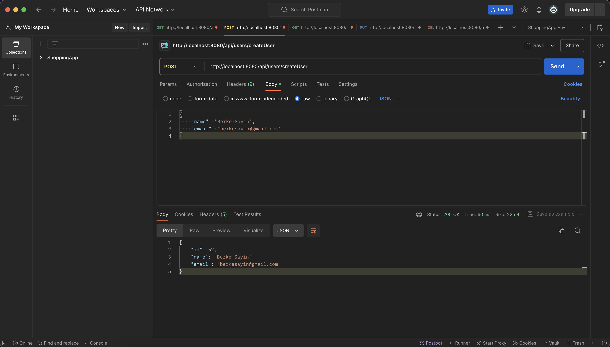
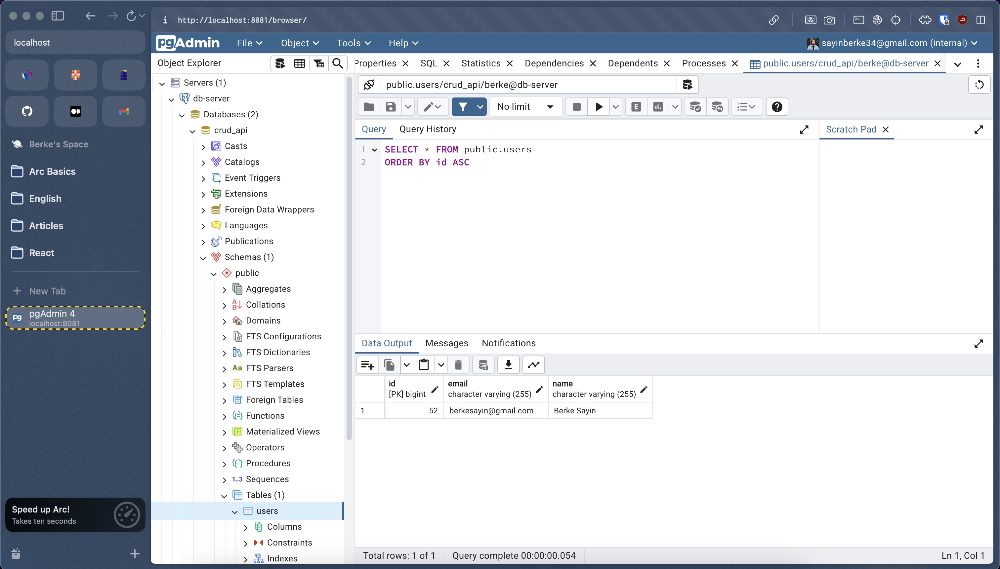

# CRUD Operations With Java

CRUD Operations using Spring and Docker.

## Table Of Contents

1. [Tech Stack](#tech-stack) <br />
2. [Docker Assets](#docker-assets) <br />
3. [Run The Application](#run-app) <br />
4. [Use Postman](#postman) <br />
5. [Postgres Admin With Container](#pg-admin) <br />

## 1. Tech Stack <a name="tech-stack"></a>

- Java
- Spring
- PostgreSQL
- Docker & Docker Compose

## 2. Docker Assets <a name="docker-assets"></a>

- Compose file: To run the 3 services for dockerized Java app, Postgres database and PG admin.
- Dockerfile: To build the Docker image for Java - Spring application.

## 3. Run The Application <a name="run-app"></a>

Execute the command to run the application with containers.

```sh
docker compose up --build
```

### Containers

```sh
docker ps
```

```sh
CONTAINER ID   IMAGE               COMMAND                  CREATED          STATUS          PORTS                           NAMES
fa7aa96e3400   crud-api-crud-app   "java -jar /app-1.0.…"   10 minutes ago   Up 10 minutes   0.0.0.0:8080->8080/tcp          crud-app-c
a663d91bc97b   postgres:12         "docker-entrypoint.s…"   21 hours ago     Up 10 minutes   0.0.0.0:5432->5432/tcp          crud-db-c
685f9814df29   dpage/pgadmin4      "/entrypoint.sh"         21 hours ago     Up 10 minutes   443/tcp, 0.0.0.0:8081->80/tcp   crud-pg-c
```

## 4. Use Postman <a name="docker-assets"></a>

API/Endpoints:

- GET http://localhost:8080/api/users/getUsers
- GET http://localhost:8080/api/users/getUserById/:id
- POST http://localhost:8080/api/users/createUser
- PUT http://localhost:8080/api/users/updateUserById/:id
- DELETE http://localhost:8080/api/users/deleteUserById



## 5. Postgres Admin With Container <a name="docker-assets"></a>

- Navigate to http://localhost:8081 for `PG Admin` and login with configurations defined at `compose.yaml`.


